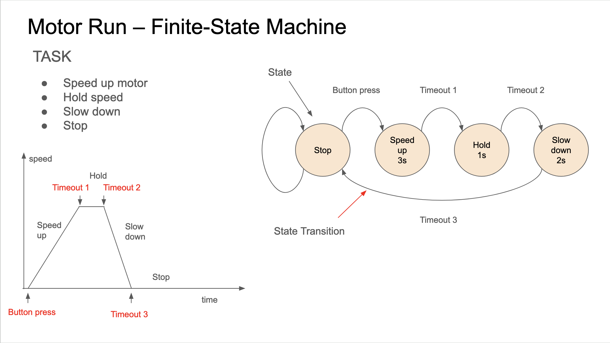

# Finite State Machine
Demonstrates implementing FSM in java
The example code is using wpilib basic class structure.
The code can be run and experimented on without a need for RoboRio.



### Compile
```
javac *.java
```

### Run
```
java Main
```
